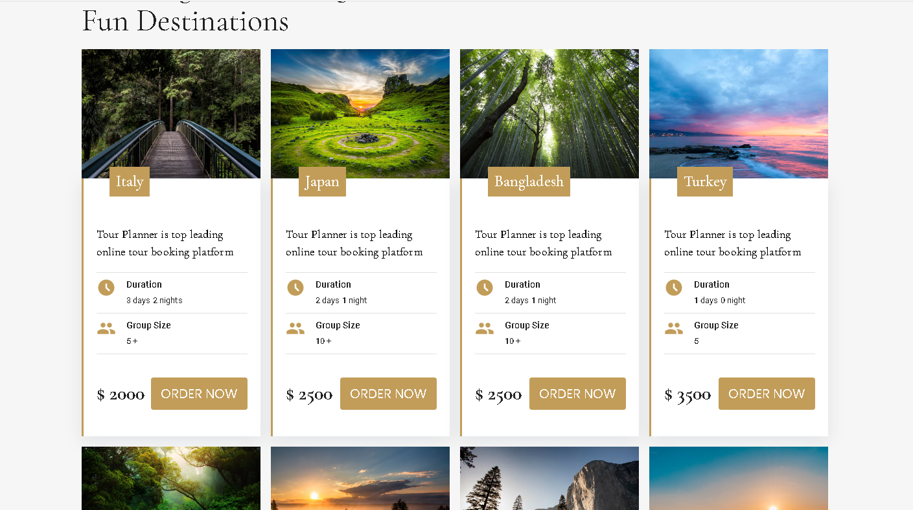
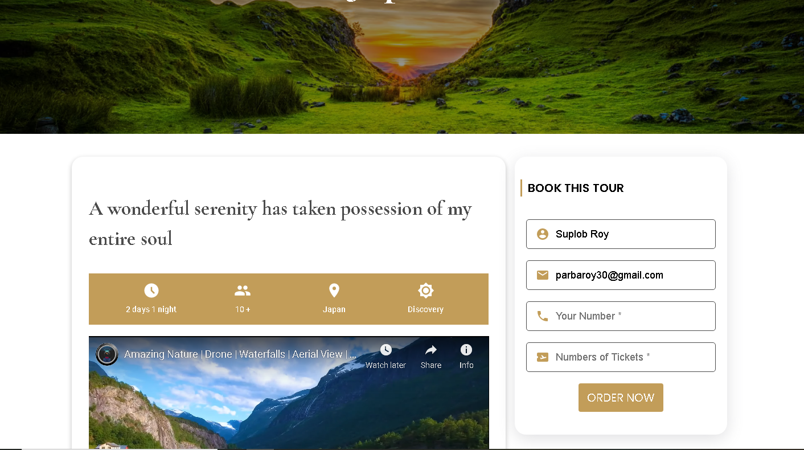
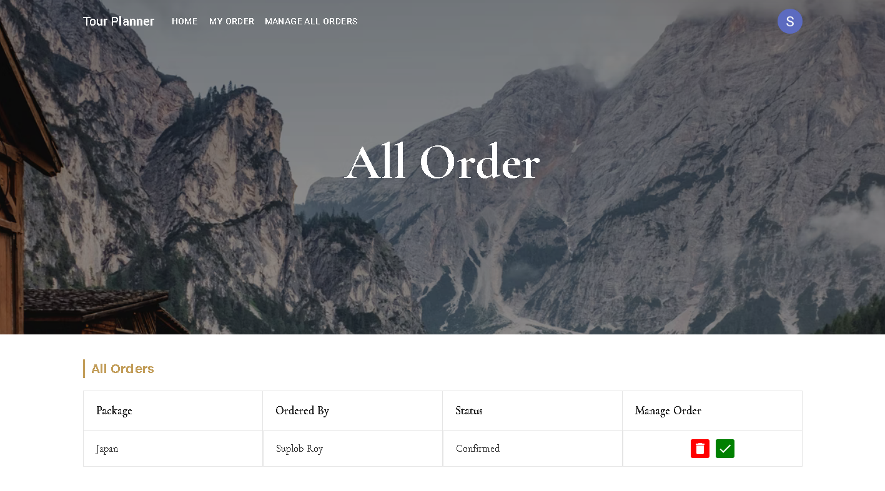

# Hand Craft

Link to [live site](https://tour-planner-suplob.web.app/)

Link to [backend code](https://github.com/Suplob/tour-planner-backend)








This is a complete full stacked website made with ReactJS and MongoDB. CRUD operations are done in this project. Email password authentication done with firebase authentication.

## Tech Stack

- ReactJS
- React Router
- MaterialUI
- Firebase Authentication
- Netlify Hosting
- SwiperJS

## How to clone this repository

```
    git clone https://github.com/Suplob/tour-planner.git
    cd tour-planner
    npm i
```
